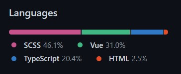

# `.gitattributes` 應用

## 檔案渲染

Github 渲染檔案時會先根據 `.gitattributes` 中的 `linguist-language` 在根據副檔名進行渲染。

```gitattributes
*.py linguist-language=Markdown
```

如果創建該如上檔案，`*.py` 將會使用 Markdown 的渲染方式進行渲染。[test.py](./test.py)

## 隱藏 `Languages`

如果你想隱藏特定程式語言( 不讓它顯示在 github languages 中 )



可以將在 `.gitattributes` 添加以下規則

```gitattributes
*.js linguist-detectable=false
```

你會發現過一段時間後你的 `Repo-Languages` 中沒有了 `JavaScript` ( 就和當前的 儲存庫一樣 )
